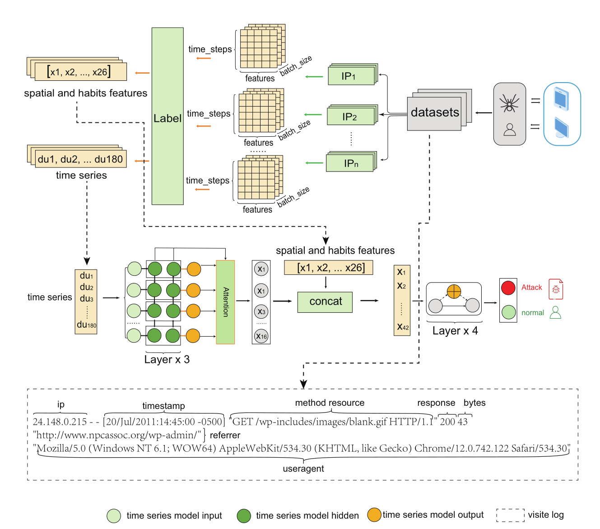

### **TS-Finder: privacy enhanced web crawler detection model using temporal–spatial access behaviors**


I am Rui Chen, the author of Ts-finder, from Dalian University of Technology, a PhD candidate. My **linkedin** link is: https://www.linkedin.com/in/rui-chen-aa0a932a4/ 

This paper was published in **The Journal of Supercomputing** , can found in: https://link.springer.com/article/10.1007/s11227-024-06133-6  

**To address the scarcity of crawler detection solutions issues, we are fully opening our crawler detection code to the public !**

From this source code, the detection model was implemented by pyTorch, and we also have implemented this detection model used by scala (Spark Framework). 

We have identified that crawler detection models **are crucial for websites  and other network service providers**, who typically possess sophisticated big data frameworks (like Spark Framework). Therefore, we have rewritten the model in Scala to reduce the cost of utilizing this model for these providers. The code comments are writen by Chinese, and they will be translated into english when I have more time **[Thank you so much]**. 


### Abstract

**Background:** Web crawler detection is critical for preventing unauthorized extraction of  valuable information from websites. 

**Current issues that need to be solved urgently:** Current methods rely on heuristics, leading to time-consuming processes and the inability to detect novel crawlers. Privacy protection and communication burdens during training are overlooked, resulting in potential privacy leaks.

**Our methods:** To address these  issues, we propose a federated deep learning crawler detection model  that analyzes access behaviors while preserving privacy. First,  individual clients locally host website data, while the central server  aggregates information for detection model parameters, eliminating raw  user data transmission or access. We then develop an innovative  algorithm constructing access path trees from user logs, effectively  extracting temporal and spatial behavior features. Additionally, we  propose a novel time series model with fused additive attention,  enabling effective web crawler detection while preserving privacy and  reducing data transmission. 

Finally, comprehensive evaluations on public datasets demonstrate robust privacy protection and effective detection  of emerging crawler types.




####  Citation Information

  If you find TS-Finder useful for your research, please cite our [paper](https://link.springer.com/article/10.1007/s11227-024-06133-6),  and thank you for issue me a good comment or giving me a star! 

```
@article{zhao2024ts,
  title={TS-Finder: privacy enhanced web crawler detection model using temporal--spatial access behaviors},
  author={Zhao, Jing and Chen, Rui and Fan, Pengcheng},
  journal={The Journal of Supercomputing},
  volume={80},
  number={12},
  pages={17400--17422},
  year={2024},
  publisher={Springer}
}
```


#### 使用解释 Usage Guide

我们都知道，爬虫检测 - 爬虫的防护是一个非常棘手的问题。主要受限于**两个情况**：一个是目标**公司他们不愿意分享相关技术**，另外一个是网上公开的爬虫检测算法几乎没有考虑工业界（**说人话就是没法用！**）。

而我们设计的此爬虫检测算法，充分考虑工业界，采用了LSTM时序模型检测爬虫。


在初期考虑到贵公司的数据很少，所以只要您提供 一部分的正常http请求数据，一部分的http爬虫数据（该数据很好获的，就是采集那些人工就能看出来是爬虫的请求数据，大概个2000条），然后训练他。


在初期的时候检测效果可能会不佳，但是已经可以检测到一部分的新的爬虫了，您再利用这些新的爬虫的产生的http请求数据，作为新的训练数据进行训练，以此往复不断地进行，该算法即可自动成长学习，而且他所需的GPU成本也非常少（2000人民币的 3060Ti就可以快速的训练），非常值得试试。


**如果您在使用的过程遇到任何困难（算法的理解、部署、使用等等任何相关问题），请随时在issue那个栏目里面提交评论，我非常乐意给予解答。**

**If you have problems about using it in practical environment, please feel free issue me! of course just issue! hahaha!**  


